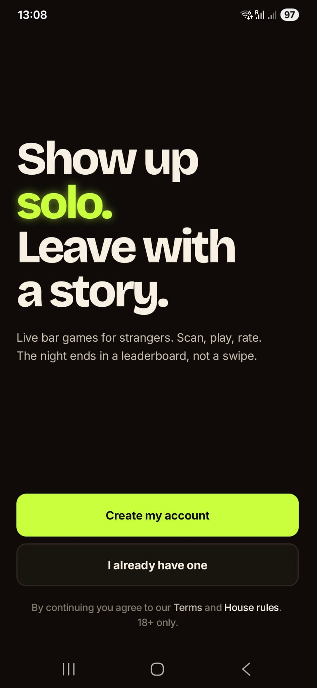
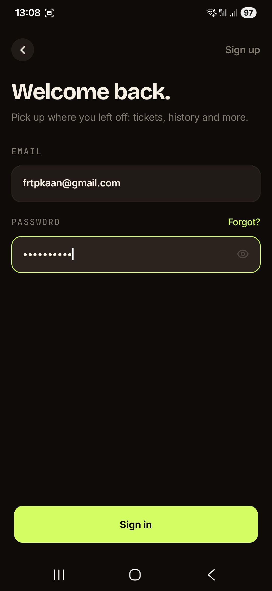
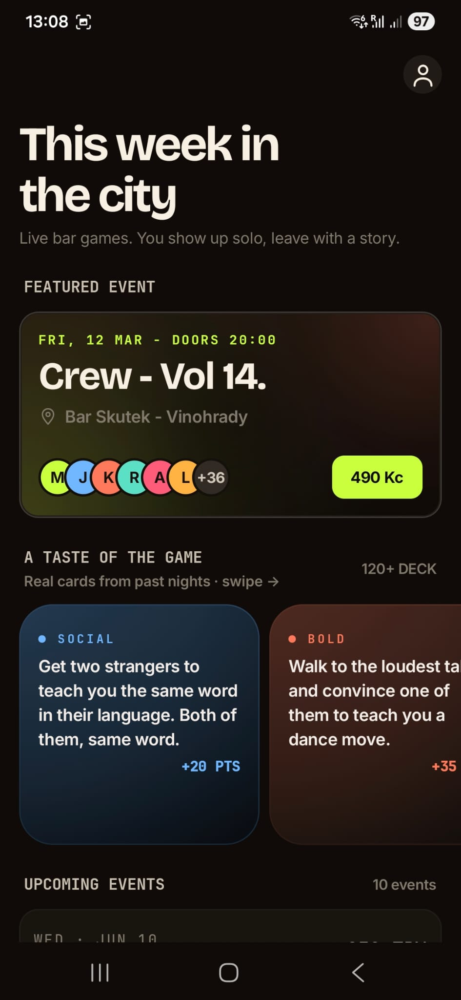
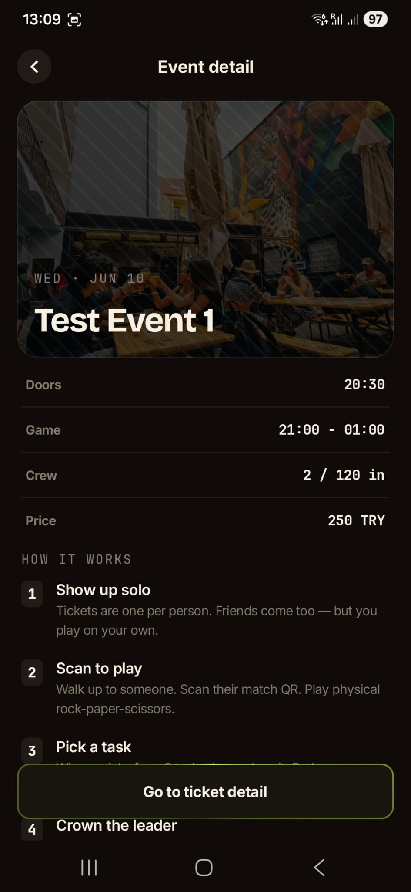
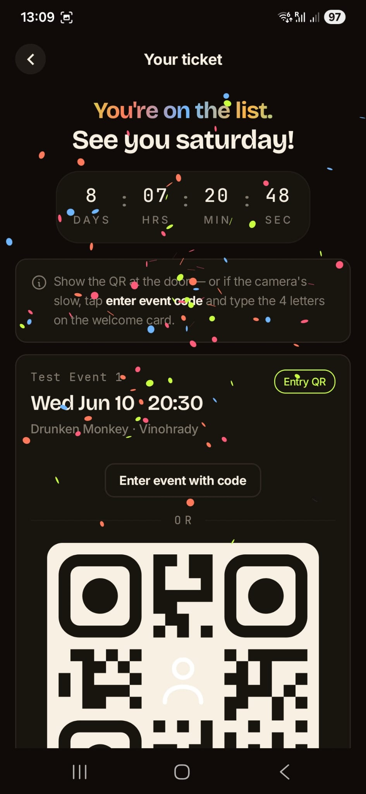
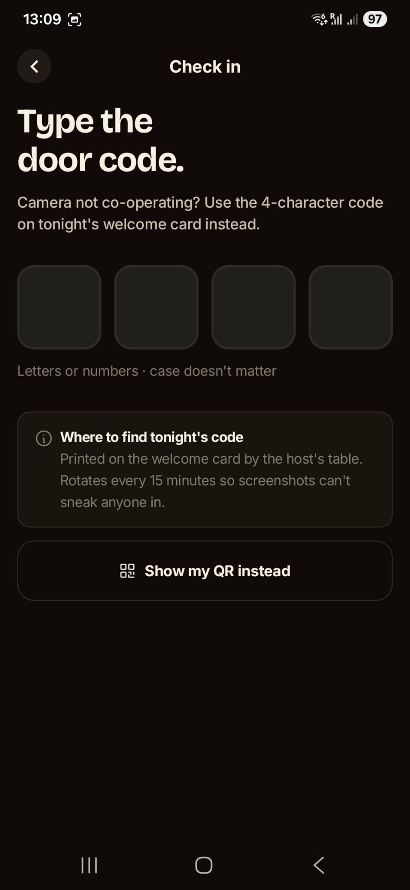
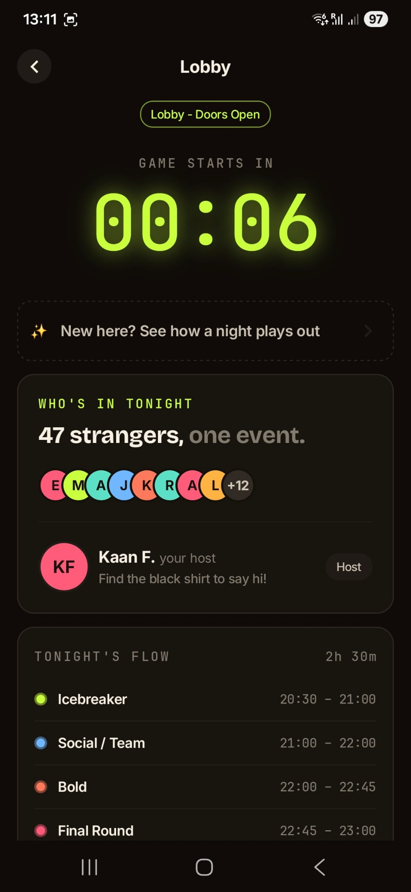
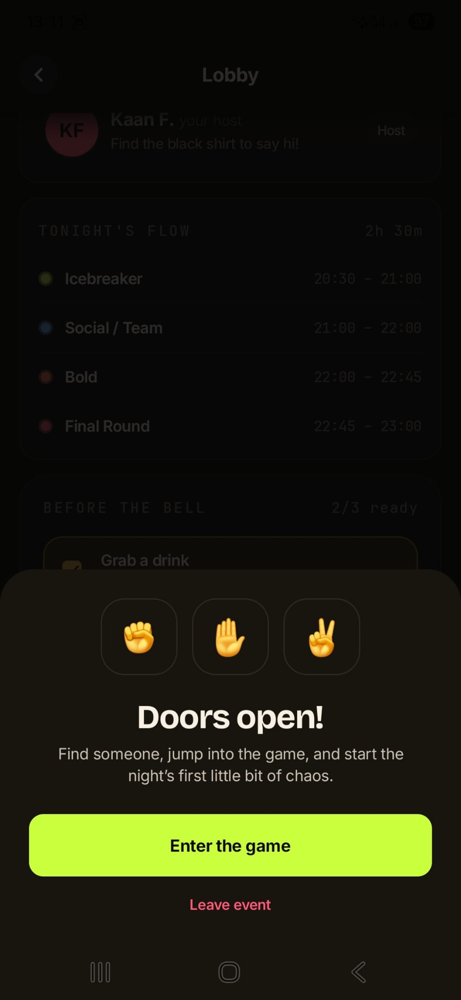
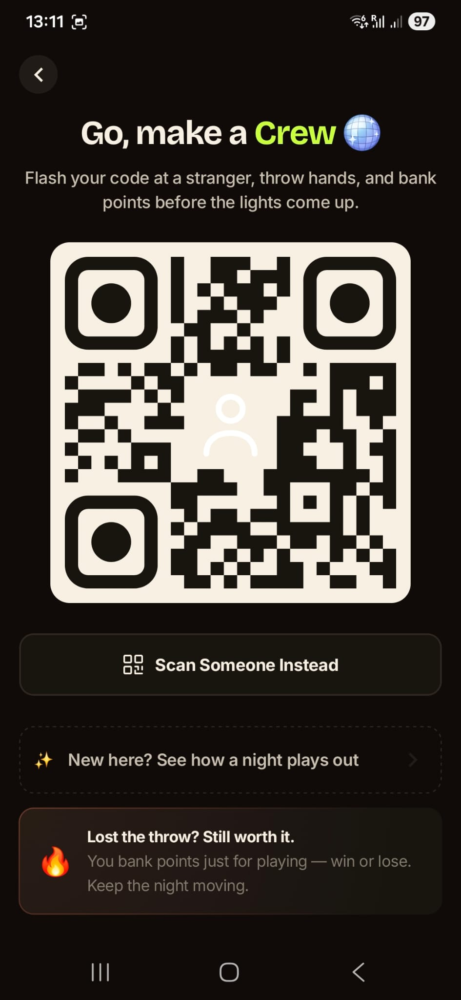
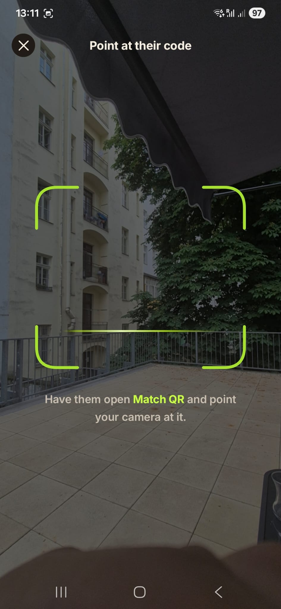

**Tech Stack :** Kotlin, Kotlin Multiplatform, KMP, Compose Multiplatform, Jetpack Compose, Android, iOS, SwiftUI, Material 3, Navigation Compose, Gradle Kotlin DSL, Ktor Client, REST API, WebSocket, Kotlinx Serialization, Coroutines, Flow, Koin Dependency Injection, DataStore Preferences, Coil, QR Code, Clean Architecture, MVVM, Modular Architecture, Detekt, Ktlint, Fastlane.
**Platforms & Architecture:** Android SDK 36, iOS, Shared Kotlin Codebase, Multi-module Architecture, Feature-based Modules, Repository Pattern, Bearer Token Authentication, Refresh Token Flow, Real-time Event Updates.

# Crew

Crew, fiziksel etkinliklerde tanışmayı oyunlaştıran Kotlin Multiplatform mobil uygulamasıdır. Kullanıcılar hesap oluşturur, e-posta doğrulaması yapar, etkinlikleri görüntüler, bilet/QR akışına girer ve etkinlik alanında gerçek zamanlı oyun sürecine katılır.

Uygulama Android ve iOS için ortak Kotlin/Compose kodu kullanır. Android tarafı Compose ile, iOS tarafı SwiftUI içinde `ComposeApp` framework'u ile çalışır.

## Ekran Görüntüleri

<table>
  <tr>
    <td align="center">
      <br />
      <sub><strong>Welcome</strong></sub>
    </td>
    <td align="center">
      <br />
      <sub><strong>Login</strong></sub>
    </td>
    <td align="center">
      <br />
      <sub><strong>Dashboard</strong></sub>
    </td>
    <td align="center">
      <br />
      <sub><strong>Event Detail</strong></sub>
    </td>
    <td align="center">
      <br />
      <sub><strong>Ticket QR</strong></sub>
    </td>
  </tr>
  <tr>
    <td align="center">
      <br />
      <sub><strong>Enter Code</strong></sub>
    </td>
    <td align="center">
      <br />
      <sub><strong>Game Lobby</strong></sub>
    </td>
    <td align="center">
      <br />
      <sub><strong>Lobby Starts</strong></sub>
    </td>
    <td align="center">
      <br />
      <sub><strong>Game</strong></sub>
    </td>
    <td align="center">
      <br />
      <sub><strong>Scan Opponent</strong></sub>
    </td>
  </tr>
</table>

## Öne Çıkanlar

- Kotlin Multiplatform ile Android ve iOS için ortak UI, domain ve data katmanı.
- Compose Multiplatform, Material 3 ve custom design system ile tutarlı mobil arayüz.
- Feature-based modular yapı: `auth`, `home`, `game` modülleri.
- Clean Architecture yaklaşımı: `presentation`, `domain`, `data` ayrımı.
- MVVM state yönetimi: `ViewModel`, `StateFlow`, event/action/state modelleri.
- Ktor Client ile REST API entegrasyonu, JSON serialization ve merkezi hata yönetimi.
- Bearer token authentication, refresh token akışı ve DataStore tabanlı session persistence.
- Ktor WebSocket ile canlı etkinlik/oyun mesajlarını dinleme.
- QR ticket, event code check-in, opponent scan ve oyun sonuç akışları.
- Koin ile dependency injection.
- Detekt, Ktlint, Android Lint ve Fastlane destekli geliştirme altyapısı.

## Ürün Akışı

- **Auth:** Welcome, login, register, forgot password, email verification ve deep link destekli doğrulama sonucu.
- **Home:** Etkinlik dashboard'u, etkinlik detayı, ticket oluşturma/görüntüleme, QR ve event code ile giriş.
- **Game:** Lobby, personal match QR, opponent scan, ready state, winner/loser onayları, challenge seçimi, task active ve reveal ekranları.

## Mimari

```text
composeApp                  # KMP uygulama girişi, navigation root, Android/iOS bridge
core:designsystem           # Tema, typography, buttons, cards, sheets, QR/image components
core:presentation           # Ortak UI modelleri, permission helpers, snackbar utilities
core:domain                 # Ortak domain modelleri, result/error modelleri, repository contracts
core:data                   # Ktor client, session storage, DTO mapper'ları, platform data providers
feature:auth                # Authentication presentation/domain/data
feature:home                # Event, ticket ve check-in presentation/domain/data
feature:game                # Real-time game presentation/domain/data
build-logic                 # Convention plugins ve ortak Gradle ayarları
iosApp                      # SwiftUI host app
```

## Teknolojiler

| Alan | Kullanılan Teknolojiler |
| --- | --- |
| Language | Kotlin 2.2, Swift |
| Cross-platform | Kotlin Multiplatform, Compose Multiplatform |
| Mobile UI | Jetpack Compose, Material 3, SwiftUI host |
| Architecture | Clean Architecture, MVVM, Modular Architecture |
| Async | Kotlin Coroutines, Flow, StateFlow |
| Networking | Ktor Client, REST API, WebSocket |
| Serialization | Kotlinx Serialization |
| Dependency Injection | Koin |
| Persistence | AndroidX DataStore Preferences |
| Media/UI Utilities | Coil, Chaintech QR Kit, ConfettiKit |
| Build & Quality | Gradle Kotlin DSL, Convention Plugins, Detekt, Ktlint, Android Lint |
| Release | Fastlane for iOS build lane |

## Gereksinimler

- JDK 17
- Android Studio
- Xcode ve iOS simulator/device
- Kotlin Multiplatform uyumlu Gradle ortamı
- API sunucusu: `core/data/src/commonMain/kotlin/com/kaanf/core/data/networking/UrlConstants.kt` içindeki HTTP ve WebSocket adresleri aktif olmalıdır.

## Çalıştırma

Android debug build:

```bash
./gradlew :composeApp:assembleDebug
```

Android kalite kontrolleri:

```bash
./gradlew ktlintCheck detekt androidLint
```

iOS için Xcode ile aç:

```bash
open iosApp/iosApp.xcodeproj
```

iOS Fastlane build:

```bash
bundle exec fastlane ios ios_build
```

## Notlar

- `composeApp` ana uygulama modülüdür; `androidApp` klasörü mevcut olsa da Gradle settings içinde aktif modül olarak dahil edilmemiştir.
- Backend adresleri şu an source içinde sabit tanımlıdır. Farklı ortamlar için `UrlConstants` veya BuildKonfig tabanlı ortam ayrımı kullanılabilir.
- Proje feature bazlı ayrıldığı için yeni ekran veya akış eklerken ilgili feature altında `presentation/domain/data` sınırlarını korumak gerekir.
